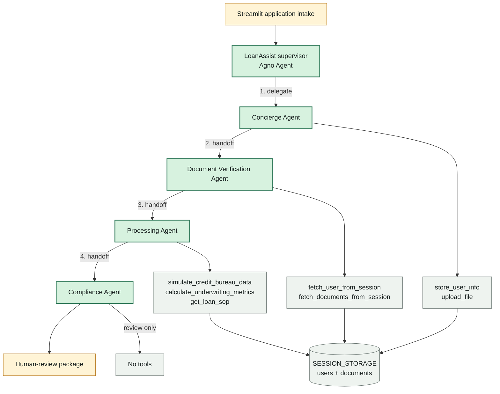
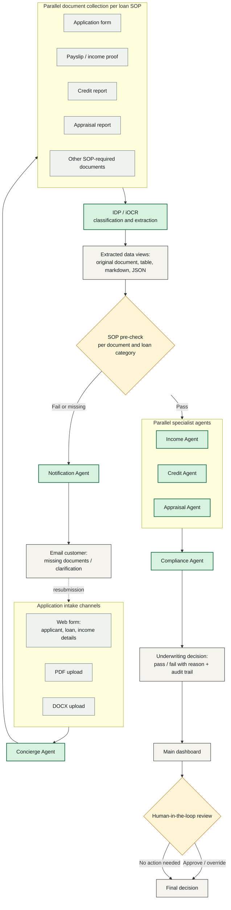
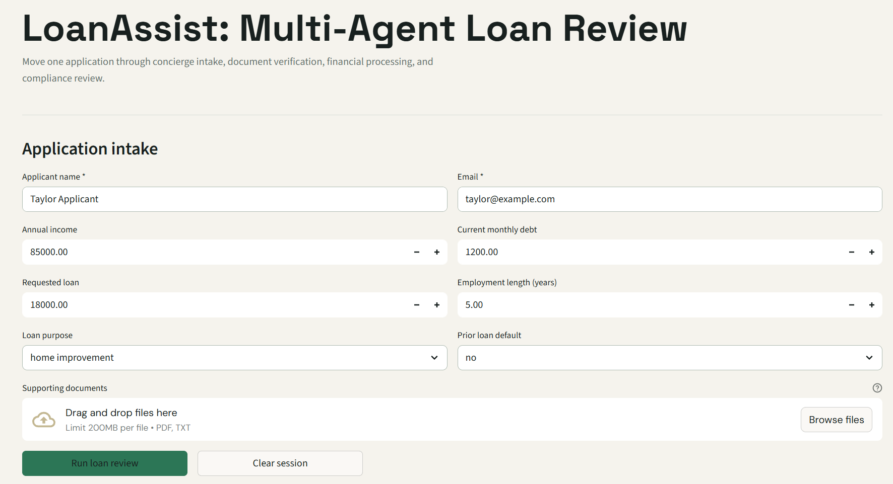
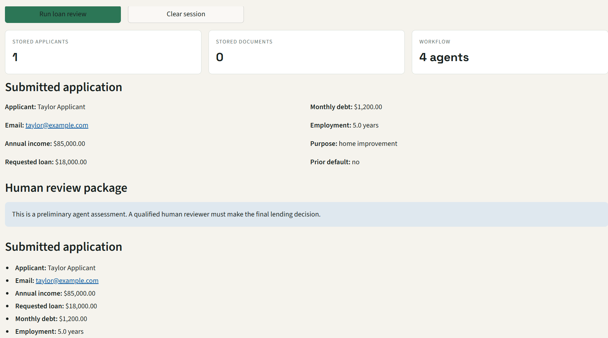
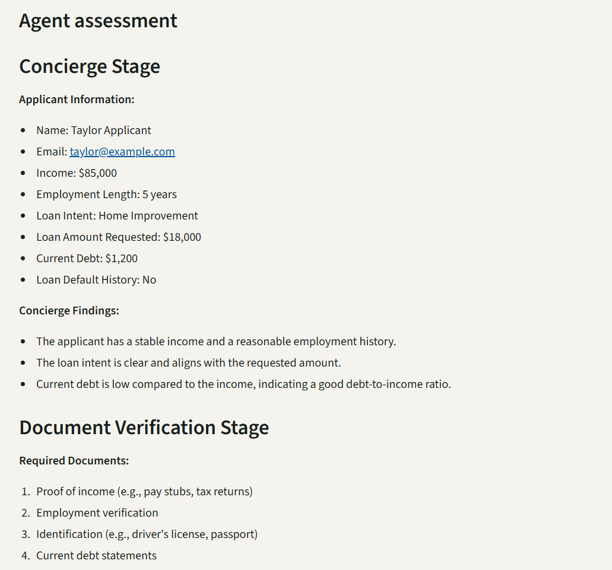
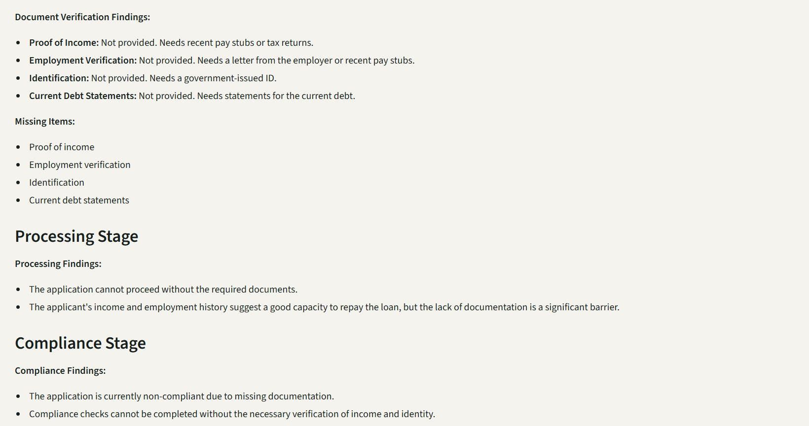
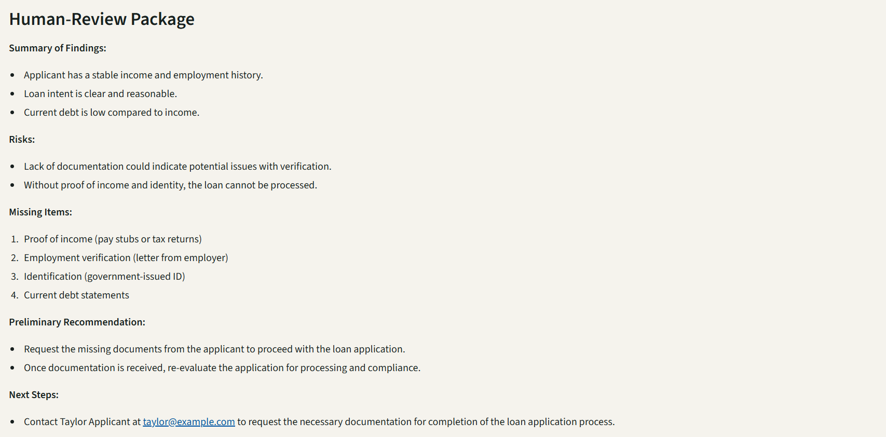
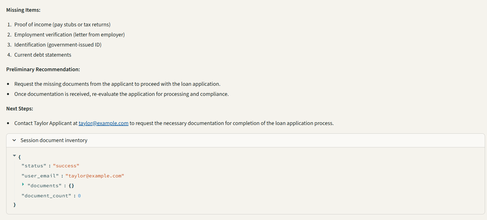

# Multi-Agent-Loan-Processing-System

A lightweight Agno-based multi-agent loan processing system organized around four sequential stages: concierge intake, document verification, processing, and compliance review.

## Architecture



The supervisor delegates the application in order. Each specialist agent has
its own scoped tools, while the storage and processing tools share the same
session data. Compliance is intentionally review-only and produces the final
package for a human decision-maker.

- **`app.py`** — Streamlit UI for application intake, document upload, and
  triggering the review; renders the human-review package.
- **`loan_processing_system/__main__.py`** — builds the `LoanAssist` Agno
  `Agent`, which orchestrates the four specialist agents as tools and is
  invoked via `.run(prompt)`.
- **`loan_processing_system/agents/`** — one Agno `Agent` per stage
  (concierge, document verification, processing, compliance), each with its
  own instructions and a scoped set of tools.
- **`loan_processing_system/tools/storage_tools.py`** — in-memory session
  store (`SESSION_STORAGE`) plus functions to save/fetch applicants and
  documents, and extract text from uploaded PDFs.
- **`loan_processing_system/tools/financial_tools.py`** — credit bureau
  simulation and underwriting/DTI/risk-score calculations.
- **`loan_processing_system/tools/sop_tools.py`** — category-specific standard
  operating procedures for student, business, home-improvement,
  debt-consolidation, medical, education, and other personal loans.
- **`config.py`** — `AgentConfig` reads `MODEL_ID`, `TEMPERATURE`, and
  `TOP_P` from the environment for the OpenAI model used by every agent.

Data flows one way: the UI writes the applicant/documents into session
storage, the supervisor delegates to each specialist agent in sequence, and
each agent reads from session storage and/or calls its tools before handing
off to the next stage. No agent can clear session storage during a review.

### Runtime Architecture

The application has four layers:

1. **Presentation layer**
  - `app.py` runs the Streamlit interface.
  - Applicants enter identity, financial, employment, and loan-purpose data.
  - Supporting PDF or text files can be uploaded before processing.
  - Streamlit session state preserves the submitted application and review
    package across reruns.

2. **Orchestration layer**
  - `LoanAssist` is the top-level Agno supervisor agent.
  - It receives the submitted application and delegates work to the four
    specialist agents.
  - The supervisor is limited to specialist-agent tools during a review and
    cannot clear or overwrite session storage.

3. **Specialist-agent layer**
  - Each specialist has its own system instructions and only the tools it
    needs.
  - Agents communicate through the supervisor's ordered prompt and shared
    session storage rather than directly mutating one another's state.

4. **Tool and storage layer**
  - `storage_tools.py` stores applicant records and uploaded documents in
    the in-memory `SESSION_STORAGE` object.
  - PDF content is extracted when documents are fetched by the verification
    or processing agent.
  - `financial_tools.py` provides credit-data simulation and underwriting
    calculations.

### Agent Workflow

```text
1. Streamlit intake
  |
  | store_user_info() and upload_file()
  v
2. Concierge Agent
  | Confirms the applicant profile and loan request.
  v
3. Document Verification Agent
  | Fetches the applicant and all documents, extracts text, and reports
  | missing, inconsistent, or unverifiable evidence.
  v
4. Processing Agent
  | Reads the verified application package, obtains or simulates credit data,
  | calculates payment and DTI metrics, and prepares a preliminary assessment.
  v
5. Compliance Agent
  | Consolidates the findings, identifies regulatory or documentation risks,
  | and prepares a human-review package.
  v
6. Streamlit human-review output
  | Shows submitted data, findings, risks, missing items, recommendation,
  | and next steps. A human reviewer makes the final lending decision.
```

#### Agent Responsibilities

| Agent | Responsibility | Tools |
| --- | --- | --- |
| Concierge Agent | Capture and confirm applicant information and documents. | `store_user_info`, `upload_file` |
| Document Verification Agent | Retrieve documents, extract text, and validate application evidence. | `fetch_user_from_session`, `fetch_documents_from_session` |
| Processing Agent | Analyze income, debt, credit risk, DTI, and preliminary underwriting outcome. | `simulate_credit_bureau_data`, `calculate_underwriting_metrics`, document tools |
| Compliance Agent | Review the complete package and identify missing evidence or compliance concerns. | None; review-only |

#### Decision Boundary

The system intentionally stops at a **preliminary recommendation**. It does
not issue an autonomous final approval or decline. The final decision belongs
to a qualified human reviewer after reviewing the agent findings and required
supporting documents.

### Practical End-to-End Workflow (Extended Design)

The diagram above reflects the current MVP implementation. The design below
is the target enterprise-style workflow this project is moving toward,
inspired by intelligent document processing (IDP) and multi-agent
loan-automation patterns. It is documented here as the roadmap; parts not yet
implemented in code are noted explicitly.



Key characteristics of this extended design:

1. **Multi-channel intake** — applicants can fill a web form or upload a
   completed loan application as a PDF or DOCX file.
2. **Parallel document collection** — the documents required at this stage
   depend on the loan-category SOP (for example, a payslip and credit report
   for a personal loan, or an appraisal report for a home loan).
3. **IDP/iOCR classification and extraction** — documents are classified by
   type and their data is extracted so it can be reviewed as the **original
   document**, a **table**, **Markdown**, or **JSON** — not just raw text.
4. **SOP pre-check** — each extracted document is validated against the
   loan-category SOP. Every check records a pass/fail result and a reason.
5. **Automatic customer follow-up** — if a required document is missing or
   fails validation, a Notification Agent sends the customer an email listing
   exactly what is missing or needs clarification, instead of stalling
   silently.
6. **Parallel specialist agents** — Income, Credit, and Appraisal agents
   evaluate their areas independently once documents pass the pre-check, then
   hand off to Compliance for the final consolidated review.
7. **Underwriting decision with audit trail** — every decision records the
   pass/fail reason so it can be reviewed later.
8. **Dashboard and human-in-the-loop** — every processed application appears
   on a dashboard with applicant details, requested loan amount, creation
   date, agent decision, number of documents processed, and how many passed
   or failed the SOP checks. A reviewer can open any entry for full detail
   and override the decision; otherwise the agent decision is used as-is.

This design is intended to reduce manual document handling and repeated
back-and-forth with applicants, while still keeping a human reviewer in
control of the final decision.

**Implementation status:** the current codebase implements items 1–4 in a
simplified form (web form + PDF/text upload, category-specific SOP, and
document verification) and produces a single combined recommendation instead
of separate Income/Credit/Appraisal agents. The Notification Agent, parallel
specialist agents, and dashboard are documented here as the next milestones.

### Category-Specific SOPs

The selected loan purpose determines the SOP used by the Processing and
Compliance agents. The SOP is returned by `get_loan_sop()` and contains:

- Required documents for that loan category
- Category-specific verification and underwriting checks
- The main decision focus for the human reviewer

Examples:

| Loan category | SOP emphasis |
| --- | --- |
| Student or education loan | Enrollment/admission, eligible education costs, borrower or co-signer affordability |
| Business or small-business loan | Business registration, ownership, revenue, cash flow, and use of funds |
| Home improvement loan | Property authorization, contractor estimate, project purpose, and affordability |
| Debt consolidation loan | Creditor statements, payoff amounts, post-loan DTI, and controlled use of funds |
| Medical loan | Provider estimate, medical expense verification, and affordability |

The active SOP is shown in the Streamlit interface before review and is also
included in the supervisor prompt so the agents use the selected loan-category
procedure instead of a generic checklist.

## Workflow

The implementation uses specialized agents that run in order:

1. Concierge agent: collects the customer profile
2. Document verification
3. Processing agent: runs financial analysis, underwriting, and risk assessment
4. Compliance agent: checks consent, identity, and sanctions status
5. Decision-package generation for human review

## Agent Tools

- **Storage tools** for customer profile assembly and document verification
- **Financial tools** for payment, debt-to-income, and risk-tier analysis
- **Agno Agent supervisor** for coordinating the four specialist agents

## Project structure

```text
Multi-Agent-Loan-Processing-System/
├── app.py                              # Streamlit application UI
├── config.py                           # Agno/OpenAI model configuration
├── requirements.txt                    # Python dependencies
├── LICENSE                             # Project license
├── README.md                           # Project documentation
├── .streamlit/
│   └── config.toml                     # Light Streamlit theme configuration
├── assets/
│   ├── app_ui_1.png                    # Intake and application UI
│   ├── app_ui_2.png                    # Agent workflow output
│   ├── app_ui_3.png                    # Review package output
│   ├── app_ui_4.png                    # Document verification output
│   ├── app_ui_5.png                    # Compliance review output
│   └── app_ui_6.png                    # Missing-items and next-steps output
├── loan_processing_system/
│   ├── __init__.py                     # Public package exports
│   ├── __main__.py                     # LoanAssist supervisor entry point
│   ├── agents/
│   │   ├── __init__.py                 # Specialist agent exports
│   │   ├── concierge_agent.py          # Concierge Agent
│   │   ├── document_verification_agent.py
│   │   ├── processing_agent.py          # Financial processing Agent
│   │   └── compliance_agent.py          # Human-review Agent
│   └── tools/
│       ├── __init__.py                 # Tool exports
│       ├── storage_tools.py             # Applicant/document session storage
│       ├── financial_tools.py           # Credit and underwriting calculations
│       └── sop_tools.py                 # Category-specific loan SOPs
└── tests/
  ├── __init__.py
  └── test_agents.py                  # Agent and storage tests
```

The `agents/` directory contains the four specialist Agno agents. The
`tools/` directory contains the functions exposed to those agents. The
Streamlit UI calls the supervisor from `__main__.py`, while the supervisor
delegates the application through the specialist agents in order.

## Run the demo

```bash
python -m loan_processing_system
```

Set `OPENAI_API_KEY` before running the demo. `MODEL_ID`, `TEMPERATURE`, and `TOP_P` can be used to configure the OpenAI model through the environment.

## Run the Streamlit app

```bash
streamlit run app.py
```

The app provides application intake, document upload, session status, agent processing, and a human-review package. Set `OPENAI_API_KEY` before starting it.

## Run tests

```bash
python -m unittest discover -s tests -p 'test*.py'
```

## Application Screenshots

The screenshots below show the application intake, agent handoffs, and final
human-review output. They are kept in the repository under `assets/` so the
README renders them directly from the project.

### Intake and Workflow







### Verification and Review






