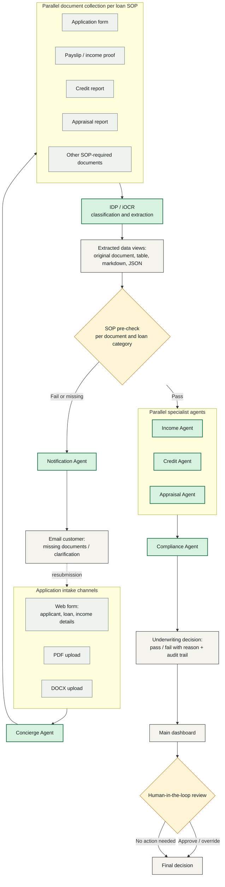
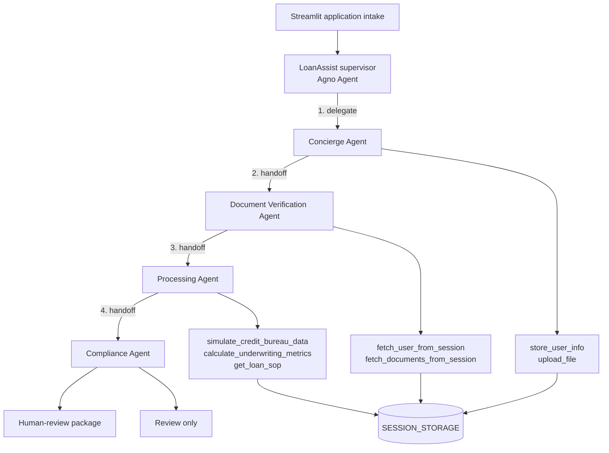

# LoanAssist

## Agno Multi-Agent Loan Processing

LoanAssist is a category-aware multi-agent loan review concept built with Agno. A local demo interface illustrates the workflow: concierge intake, document verification, financial processing, and compliance review before preparing a package for a qualified human decision-maker.

> This system produces a preliminary recommendation. It does not make an autonomous final lending decision.

## Practical End-to-End Workflow

This is the target enterprise-style workflow for LoanAssist, inspired by
intelligent document processing (IDP) and multi-agent loan-automation
patterns. See the note at the bottom for what is implemented today versus
what is on the roadmap.



- **Multi-channel intake** — web form, PDF upload, or DOCX upload.
- **Parallel document collection** — the required documents depend on the
  loan-category SOP (payslip and credit report, appraisal report, etc.).
- **IDP/iOCR classification and extraction** — documents are classified and
  their data extracted for review as the original document, a table,
  Markdown, or JSON.
- **SOP pre-check** — every document is validated against the loan-category
  SOP with a pass/fail result and a reason.
- **Automatic customer follow-up** — missing or failed documents trigger an
  email listing exactly what is needed, instead of stalling silently.
- **Parallel specialist agents** — Income, Credit, and Appraisal agents
  evaluate independently, then hand off to Compliance.
- **Dashboard and human-in-the-loop** — every application appears on a
  dashboard with applicant details, requested amount, creation date, agent
  decision, and document pass/fail counts. A reviewer can open any entry for
  full detail and override the decision.

**Implementation status:** the current codebase implements a local demo for web/PDF/text
intake, category-specific SOP, and document verification in a simplified,
single-recommendation form. The Notification Agent, parallel specialist
agents, and dashboard are the next milestones — see the main
[README](../README.md#practical-end-to-end-workflow-extended-design) for full
details.

## Current MVP Architecture



## Category-Specific SOPs

Loan category determines the operating procedure used by Processing and Compliance:

| Category | Main checks |
| --- | --- |
| Student or education | Enrollment, tuition, eligible education costs, borrower or co-signer affordability |
| Business or small business | Registration, ownership, revenue, cash flow, and use of funds |
| Home improvement | Property authorization, contractor estimate, project cost, and affordability |
| Debt consolidation | Creditor statements, payoff amounts, post-loan DTI, and controlled use of funds |
| Medical | Provider estimate, medical expense verification, and affordability |

## Technology

- Python
- Agno agents
- OpenAI model integration
- Streamlit UI
- PDF text extraction with PyPDF2
- In-memory session storage for demonstration

## Run Locally

```bash
pip install -r requirements.txt
$env:OPENAI_API_KEY="your-api-key"
streamlit run app.py
```

Open `http://localhost:8501` in your browser.

## Screenshots


