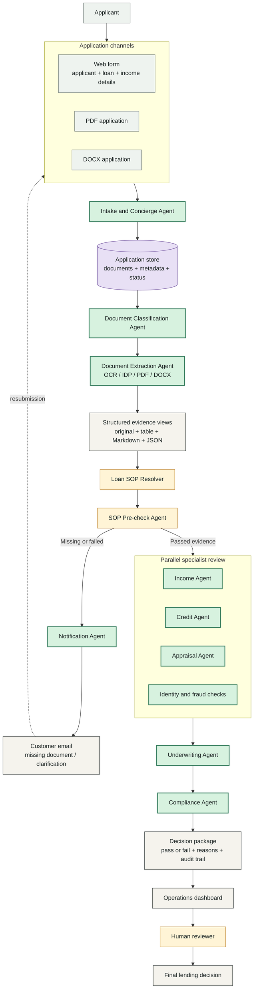

# Solution Architecture

## Architecture Goal

Create a practical loan-processing platform that accepts structured and unstructured applications, classifies and extracts document data, applies the correct loan-category SOP, runs specialist checks in parallel where possible, and presents a traceable human-review decision package.

## Target Architecture (Roadmap)



## Agent Responsibilities

| Agent | Responsibility | Main inputs | Main outputs |
| --- | --- | --- | --- |
| Intake / Concierge | Capture applicant, loan, and income details; associate files with the application. | Web form, PDF, DOCX | Application record and intake status |
| Document Classification | Identify document type and loan relevance. | Uploaded files | Document type, confidence, routing |
| Document Extraction | Extract fields and preserve source references. | PDF, DOCX, scanned images | Structured JSON, tables, Markdown, original-file link |
| SOP Resolver | Select the correct procedure for the loan category. | Loan purpose and product | Required documents and checks |
| SOP Pre-check | Confirm required evidence and data quality. | SOP + extracted evidence | Pass/fail checks with reasons |
| Notification | Request missing or unclear information. | Failed checks | Customer email and follow-up task |
| Income | Validate income, employer, pay frequency, and affordability inputs. | Payslips, tax records, bank evidence | Income findings and exceptions |
| Credit | Validate credit report, score, utilization, debt, and payment history. | Credit report and liabilities | Credit findings and risk indicators |
| Appraisal | Validate property/project value when applicable. | Appraisal and property documents | Value, LTV inputs, exceptions |
| Underwriting | Consolidate deterministic calculations and policy rules. | Passed evidence and specialist findings | Preliminary pass/fail/conditional result |
| Compliance | Review regulatory, identity, fairness, and documentation concerns. | Complete review package | Human-review package and compliance findings |

## Data Contracts

Every processed document should carry:

- Application ID
- Document ID
- Document type
- Source filename and storage reference
- Extraction status
- Extraction confidence
- Extracted fields
- Original text or page references
- Validation checks and reasons
- Created and updated timestamps

Every SOP check should carry:

```json
{
  "check_id": "income.required",
  "category": "home_improvement",
  "status": "pass",
  "reason": "Income document was provided and extracted income matches the application.",
  "evidence_ids": ["doc-123"],
  "review_required": false
}
```

## Current Demo Mapping

The existing project already implements:

- Local demo web intake
- Explicit identity, income, bank, and credit upload controls
- In-memory application and document storage
- Agno Concierge, Document Verification, Processing, and Compliance agents
- PDF/text extraction
- Category-specific SOP resolver
- Financial calculation tools
- Human-review package

The target product increments are DOCX support, OCR/IDP, persistent storage, structured extraction contracts, notification email, parallel Income/Credit/Appraisal agents, and dashboard persistence. The current local demo interface should not be treated as the production UI.

## Security and Governance

Before production deployment, add:

- Authentication and role-based access control
- Encryption in transit and at rest
- Secrets management instead of committed environment files
- PII redaction and prompt minimization
- Document retention and deletion policies
- Full audit events for agent actions and human overrides
- Model-output validation before decisions are shown to reviewers
- Human approval gates for regulated decisions
